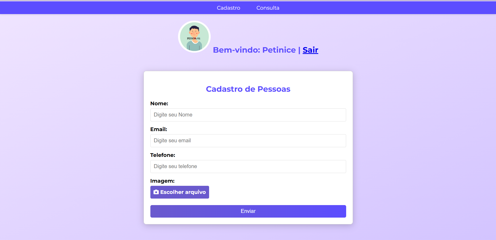

# Web Service
---
Este repositório contem uma **aplicação web** de cadastro e consulta de pessoas, realizada com o profissional Daniel Petinice durante o curso técnico de Des. de Sistemas do SENAI, para exemplificar o sistema de **hospedagem** de uma aplicação web no **Render**.

# Demonstração Visual 🔎

# Tecnologias Utilizadas 💻
- **HTML:** Estruturação do Projeto
- **CSS:** Estilização do Projeto
- **Python:** Linguagem de Programação utilizada para desenvolver a aplicação
- **Flask:** Microframework utilizado para inicializar o servidor web e gerenciar rotas

# Pré-Requisitos ⚙
- Python instalado na máquina.
- Biblioteca Flask instalada.

# Demonstração do Projeto 🚀
Para acessar uma demonstração do projeto, [clique aqui.](https://web-service-santiago.onrender.com)
Usuário de acesso para teste: **Nome:** petinelson **Senha:** 102030
